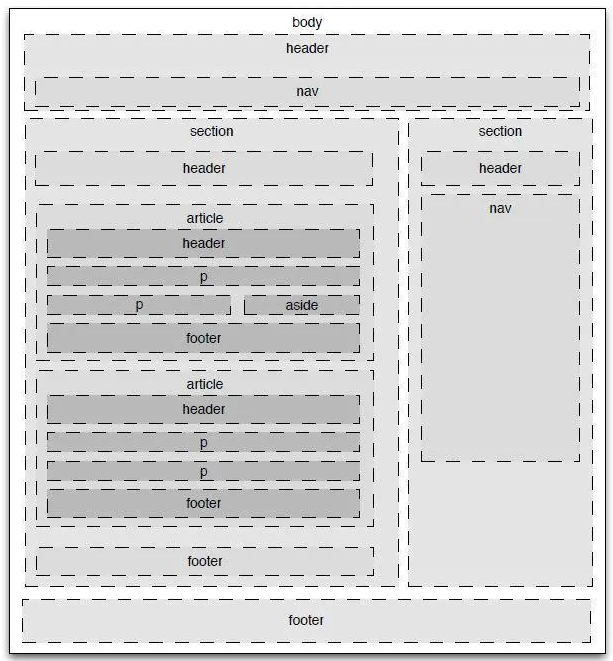

# Html

## 从 url 输入到页面展现发生了什么

1. DNS 解析，将域名转为 ip 地址

2. TCP 连接，TCP 三次握手

3. 发送 HTTP 请求

4. 服务器处理请求并返回 HTTP 报文

5. [浏览器解析渲染页面](https://blog.csdn.net/qq_41807645/article/details/80839757)

6. 断开连接，TCP 四次挥手

## favicon

> [网页图标](https://www.cnblogs.com/zyl-Tara/p/8492109.html)

* 只有 “shortcut icon” 是必要的，“icon”被作为备用，或加载其他图片

* 如果 favicon.ico 在根目录，则不需要写 link

~~~
<link rel="shortcut icon" type="image/x-icon" href="./favicon.ico">
// 其中favicon.ico需放在根目录下面（不提倡用这种方法，因为图片没有授权，违反了W3C标准，）
<link rel="shortcut icon" type="image/x-icon" href="http://www.jd.com/favicon.ico">

// ico，MIME 标识
<link rel="icon" href="favicon.ico" type="image/vnd.microsoft.icon" />
// 或者出于兼容性，使用 img/x-icon
<link rel="icon" href="favicon.ico" type="image/x-icon" />

// png
<link rel="icon" href="favicon.png" type="image/png" />

// gif
<link rel="icon" href="animated_favicon.gif" type="image/gif" />
~~~

## [语义化](https://www.jianshu.com/p/b226910034f2)

## 行内元素、块元素、行内块元素

## dom 和 bom

## dom 事件和事件流

## 事件循环
