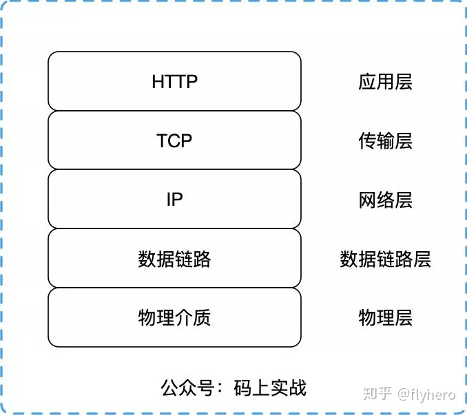

# http 超文本传输协议

> 应用层上的一种客户端/服务端模型的通信协议，由请求和响应组成，且是无状态的（http1）

* 无状态指的是，两次连接通信是没有任何关系的，每次都是一个新的连接，服务器不会记录前后的请求信息

* 客户端/服务端模型
    

* 五层网络模型
    

## URL
> Uniform Resource Locator 统一资源定位符

~~~
// http 协议
// www.baidu.com    域名指向服务器（也可以使用服务器 ip）
// www  二级域名（定义域主机，默认 www）
// baidu.com    主域名
// com  后缀
// 80   默认端口
// /base/index.html 路径
// a=1&b=2  参数（query string）
http://www.baidu.com/base/index.html?a=1&b=2
~~~

* 协议
    * http
    * https 加密协议

### URI
> Uniform Resource Identifier 统一资源标识符

## request 和 response

### request

> 客户端发送到服务端的请求

* 请求行
    > 请求方法 URL 协议版本
    ~~~
    POST /aqi/user/info HTTP/1.1
    ~~~

* 请求头
    > 头部键 : 值
    ~~~
    host: www.xxx.com
    accept: application/json
    accept-encoding: gzip,deflate,br
    accept-language: zh-CN,zh;q=0.9
    Authorization: ZFj30ADtd4NhfiFNK0ZMwv
    Cookie: Webstorm-44be9956=9e3f22e1-7481-42ea-b3f1-fea2ae3dc5f0; sidebarStatus=0
    user-agent: AppleWebKit/537.36(KHTML,like Gecko)Chrome/72.0.3626.109
    ~~~

* 请求体
    > 请求数据
    ~~~
    name: glk
    password: 123456
    ~~~
    
### response

> 服务端响应客户端

* 响应行（状态）
    > 协议版本 状态码 状态码描述
    ~~~
    HTTP/1.1 200 ok
    ~~~

* 响应头
    > 头部键 : 值
    ~~~
    access-control-allow-methods: GET,POST,OPTIONS,PUT,DELETE
    date: Tue,19 Mar 2020 02:33:04 GMT
    Content-Length: 4393
    Content-Type: application/json;charset=utf-8
    Exprise: Tue,19 Mar 2020 02:35:29 GMT
    Pragma: no-cache
    set-cookie: rememberMe=deleteMe; Path=/bdp-aqi; Max-Age=0; Expires=Sun, 27-Sep-2020 09:07:00 GMT
    ~~~

* 响应体
    > 响应数据
    ~~~
    {
        code: 0,
        data: glk
    }
    ~~~

## 状态码

> 状态码由 3 位组成，第一位定义了状态码类型

* 1 信息，服务器收到请求，需要请求者继续进行操作
    
    > OPTIONS 请求之类的

* 2 成功，操作被成功接收，并做处理
    
    * 200 请求成功

* 3 重定向，需要进一步操作以完成请求

    * 301 Moved Permanently 被请求的资源已永久移动到新位置
    
    * 303 See Other 客户端应当采用 GET 的方式访问那个资源。这个方法的存在主要是为了允许由脚本激活的POST请求输出重定向到一个新的资源
    
    * 304 Not Modified 例如，发送第二次 get 请求，文档的内容没发生变化，就从缓存获取对应文档

* 4 客户端错误，请求包含语法错误，或无法完成请求
    
    * 400 Bad Request 请求参数有误
    
    * 401 Unauthorized 需要用户验证
    
    * 403 Forbidden 服务器拒绝执行
    
    * 404 Not Found 未找到服务器资源
    
* 5 服务器错误，服务器在处理请求的过程中发生错误

    * 500 Internal Server Error 服务器内部错误
    
    * 501 501 Not Implemented
    
    * 502 服务器作为网关需要得到一个处理这个请求的响应，但得到一个错误响应
    
    * 504 当服务器作为网关，不能及时得到响应时返回此错误代码

## 请求方法

* get 

## MIME 媒体类型 Multipurpose internet Mail Extensions

> 是一种标准，用来表示文档、文件或字节流的性质和格式  
浏览器是通过 MIME 类型（而不是文件后缀名）来确定如何处理 URL  
在 http 请求中，处于 content-type 字段  
在资源加载 link script 中，使用 type 字段

### 通用结构

> type/subtype

* type
    * text          普通文件，理论上人类可读
    * image         图像，包括动态图片
    * audio         音频
    * video         视频
    * application   二进制数据

## 从输入 url 到获得页面经历的所有事情
