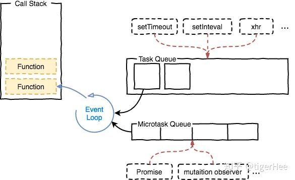

# event loop 事件循环

参考[js中的宏任务与微任务](https://zhuanlan.zhihu.com/p/78113300)

* javascript 语言的一大特点就是单线程，也就是说同一时间只能执行一件事情

* 为了协调事件、用户交互、脚本、UI渲染和网络处理等行为，防止主线程的不阻塞，所以有了 Event Loop

* event loop 包含两类：一类是基于 browsing Context，一类是基于 worker。  
  两者运行是独立的，也就说每个 javascript 运行的“线程环境”都是一个独立的 event loop，  
  每一个 web worker 也有一个独立的 event loop

# task queue 任务队列

* 事件循环是通过任务队列的机制来进行协调的。  
  一个 event loop，可以有多个任务队列（task queue）。  
  一个任务队列就是一系列有序任务的集合。  
  每个任务都有一个任务源（task source），源自同一个任务源的任务必须放到同一个任务队列，
  从不同源来的则被添加到不同任务队列。  
  setTimeout/Promise 等 API 便是任务源，而进入任务队列的是他们指定的具体执行任务（大概指的回调函数）

* 在事件队列中，每进行一次循环操作称为 tick，每一次 tick 的任务处理模型是比较复杂的，但关键步骤如下：
    * 在此次 tick 中选择最先进入队列的任务（oldest task），如果有则执行（一次）
    * 检查是否存在 Microtasks，如果存在则不停地执行，直到清空 Microtasks Queue
    * 更新 render
    * 主线程重复执行上述步骤

* 在上述 tick 的基础上需要了解几点：
    * js 分为同步任务和异步任务
    * 同步任务都在主线程上执行，形成一个执行栈
    * 主线程之外，事件触发线程管理着一个任务队列，只要异步任务有了运行结果，就在任务队列之中放置一个事件
    * 一旦执行栈中的所有同步任务执行完成（此时 js 引擎空闲），系统就会读取任务队列，
      将可运行的异步任务添加到可执行栈中，开始执行
    
    

# 宏任务

> （macro）task，可以理解每次执行栈执行的代码就是一个宏任务
  （包括每次从事件队列中获取一个事件回调并放到执行栈中执行）

* 浏览器为了能使 js 内部（macro）task 与 dom 任务能够有序的执行，
  会在一个（macro）task 执行结束后，在下一个（macro）task 执行开始前，对页面进行重新渲染
    ~~~
    （macro）task -> 渲染 -> （macro）task -> ...
    ~~~

* 宏任务包含：
    * script（整体代码）
    * setTimeout
    * setInterval
    * I/O
    * UI 交互事件
    * postMessage
    * MessageChannel
    * setImmediate（Node.js 环境）

* UI 交互事件，应该指的点击事件什么的

# 微任务

> microtask 可以理解是当前 task 执行后立即执行的任务。

* 执行在，当前 task 任务后，下一个 task 之前，渲染之前
    ~~~
    （macro）task ->microtask -> 渲染 -> （macro）task -> ...
    ~~~

* 所以同一 （macro）产生的 microtask 的响应速度比 （macro）task 会更快

* 微任务包含：
    * Promise.then
    * Object.observe
    * MutaionObserver
    * process.nextTick（Node.js 环境）

# 运行机制

* 在事件循环中，每进行一次循环操作称为 tick，每一次 tick 的任务处理模型是比较复杂的，但关键步骤如下：
    * 执行一个宏任务（栈中没有就从事件队列中获取）
    * 执行过程中如果遇到微任务，就将它添加到微任务队列
    * 宏任务执行完成后，立即执行当前微任务队列中的所有微任务（依次执行）（微任务中添加的微任务也会执行）
    * 当前宏任务执行完毕，开始检查渲染，然后 GUI 线程接管渲染
    * 渲染完毕，js 线程继续接管，开始下一个宏任务（从事件队列中获取）
    
    

~~~
console.log('script start');

setTimeout(function() {
    console.log('setTimeout1');
    Promise.resolve().then(function() {
      console.log('promise3');
    }).then(function() {
      console.log('promise4');
    });
}, 0);

setTimeout(function() {
    console.log('setTimeout2');
}, 0);

Promise.resolve().then(function() {
    console.log('promise1');
}).then(function() {
    console.log('promise2');
});

console.log('script end');

// script start
// script end
// promise1
// promise2
// undefined                // 运行的代码的最后一行的表达式没有返回值
// setTimeout1
// promise3
// promise4
// setTimeout2
~~~

# 浏览器执行线程

* 浏览器是多进程的，每个 tab 标签都代表一个独立的进程

* 其中浏览器渲染进程（浏览器内核）属于浏览器多进程的一种，主要负责页面渲染，脚本执行，时间处理等

* 其包含的线程有：GUI 渲染线程（负责渲染页面，解析HTML、CSS，构成 DOM 树）、JS 引擎线程、事件触发线程、  
  定时器触发线程、HTTP 请求线程等主要线程

# 竞争条件

> 指多个线程或者进程在读写一个共享数据时结果依赖于它们执行的相对时间的情形
