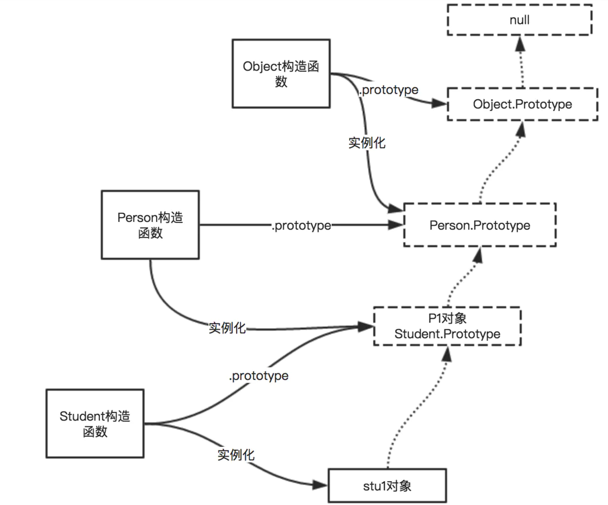

# prototype 原型

## 原型链

* 构造函数的原型的 constructor 指向构造函数
    ~~~
    Object.prototype.constructor === Object
    ~~~

* 构造函数的原型为 Object 的实例
    ~~~
    function a () {}
    Object.getPrototypeOf(a.prototype) === Object.prototype // true
    ~~~

* 原型的终点是 Object.prototype,终点之上是 null（就像是一级菜单的 pid 为 0）
    ~~~
    Object.getPrototypeOf(Object.prototype) // null
    ~~~

* 所有构造函数的本质是函数，函数的构造函数的原型是 Function.prototype
    ~~~
    function a () {}
    Object.getPrototypeOf(a) === Function.prototype                 // true
    Object.getPrototypeOf(Array) === Function.prototype             // true
    Object.getPrototypeOf(Function) === Function.prototype          // true
    Object.getPrototypeOf(Object) === Function.prototype            // true
    Object.getPrototypeOf(Function.prototype) === Object.prototype  // true
    ~~~

* Object.create(null)
    > 此方法创建的对象没有任何方法和属性，原型也是 null
    ~~~
    const obj = Object.create(null)
    obj.toString                    // undefined
    Object.getPrototypeOf(obj)      // null
    ~~~

* 设置实例的原型
    ~~~
    let a = {a: 1}
    let b = {b: 2}
    
    // __proto__
    a.__proto__ = b
    a.b                         // 2
    
    // Object.setPrototypeOf
    Object.setPrototypeOf(a, b)
    a.b                         // 2
    ~~~
    
* 获取实例的原型
    ~~~
    // Object.getPrototypeOf
    Object.getPrototypeOf(a)
    // __proto__
    a.__proto__
    ~~~

* 实例虽然是通过 new 命令和构造函数创建，但创建完成后，只和原型直接相关，和构造函数通过原型，间接相关
    ~~~
    function A () {}
    let a = new A()
    // 实例和构造函数通过原型，间接相关
    Object.getPrototypeOf(a).constructor === A
    ~~~
