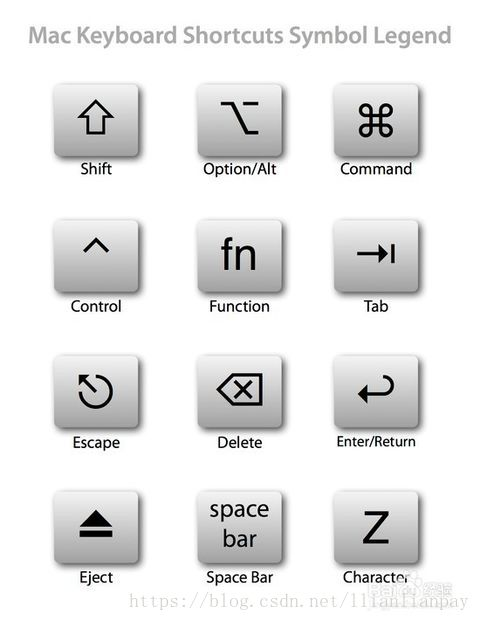
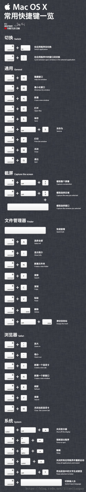

# mac

## mac 键盘使用

* ctrl + 空格     切换输入法

* fn + delete   实现向后删除

* fn + left     跳至行首（部分场景失效，或 ctrl + a ，在全部场景可用）

* fn + right    跳至行尾（部分场景失效，或 ctrl + e ，在全部场景可用）

* fn + up       上一页

* fn + down     下一页

* command + up/down     finder 文件夹上一级/下一级

Ctrl+A：到行首（达到Home键的效果）

Ctrl+E：到行尾（达到End键的效果）

Ctrl+N：到下一行

Ctrl+P：到上一行

Ctrl+K：从光标处开始删除，直到行尾

fn键+左方向键是HOME

fn键+右方向键是END

fn+上方向键是page up

fn+下方向键是page down

## 快捷方法

* 在文件夹位置打开 terminal
    * 方法：文件夹右击，选择'新建位于文件夹位置的终端窗口'
    * 预设：系统偏好设置 -》键盘 -》快捷键 -》服务，选中右侧'新建位于文件夹位置的终端窗口'

## mac 的 terminal 命令

* open + .  打开 finder

* ls    查看当前文件夹下内容
    * ls + 路径   查看路径文件夹下内容
    
* cd    跳至 ～（即 /Users/guolinkai ）文件夹
    * cd + 路径   跳至路径文件夹

* vi/vim    编辑文件（对于不存在的文件 会在保存后生成）

## mac 的符号对应键盘

* ^   对应 ctrl

Mac键盘图标与对应快捷按键

⌘——Command () win键

⌃ ——Control ctrl键

⌥——Option (alt)

⇧——Shift

⇪——Caps Lock

fn——功能键就是fn

.m.h切换 ⌘+⌃ +↓or↑

前进后退文本文件⌘+⌃ +←or→

关闭当前文本文件⌘+⌃+w

自动排版代码 ⌃+i

左右缩进 ⌘+[or]

注释 ⌘+/

查看名称定义，进入头文件 ⌘+鼠标左键

查看名称api文档 ⌥+鼠标左键

快捷键功能

Command A 全选   
Command C 拷贝   
Command V 粘贴   
Command X 文字剪切（不支持文件剪切）   
Command ，偏好设置   
Command W 关闭当前窗口   
Command Q 关闭当前程序   
Command Shift Q 退出所有程序并注销   
Command Option esc 强制退出应用程序，类似于win下的任务管理器   
Command N 新建当前程序的文件   
Command S 保存   
Command Shift S 另存为….（部分程序适用）   
Command H 隐藏当前程序（Boss Key）   
Command Option H 隐藏所有后台程序   
Control Shift 光盘推出键黑屏（没有Boss Key好用，一动就亮）   
Command P 打印   
Command Shift P 页面设置   
Command tab 切换到下一个应用程序   
Command Shift tab 切换到上一个应用程序   
Command ~ 在同一程序的不同窗口下切换，safari上网经常用   
Command M 最小化当前窗口   
Command Option F 有搜索栏的程序跳到搜索栏，如Preview(预览)的搜索栏，Safari的Google栏    

* 

* 
